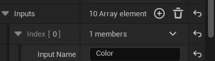
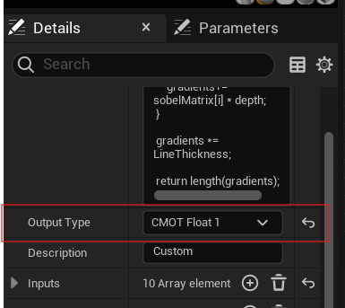
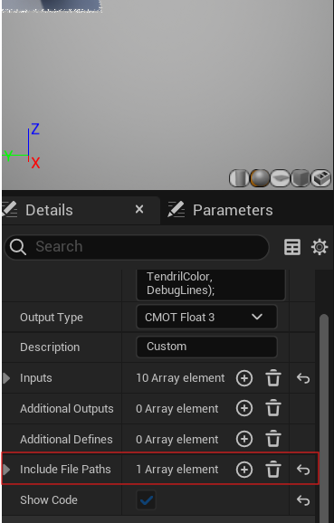

## Introduction

While the material graph in UE5 is quite complete, sometimes using HLSL is a better alternative. For example, not only are for loops nowhere to be found in the material graph, it can also get tedious and messy very fast as the complexity of a shader increases.

In this post, I will showcase some ways to create shaders using HLSL and explain their pros and cons. Rest assured, none of these will require you to tackle the tedious task of building UE5 from source.

## The custom node

The easiest and fastest way to create shaders with HLSL in UE5 is by using the custom node in the material graph.

Let’s create a simple edge detection shader using the scene depth buffer. If you’re unfamiliar with using a Sobel matrix for this purpose, I recommend watching [this video](https://www.youtube.com/watch?v=PXLgkxRizPI&t=1158s), which explains the basics.

First, we’ll write the shader code directly in the node’s HLSL input:

```c++
float2 pixelSize = LineThickness / ScreenSize;
float2 sobelMatrix[9] = {float2(-1, -0.5f), float2(0, -1), float2(1,-0.5f),
                         float2(-1, 0), float2(0,0), float2(1,0),
                         float2(-1, 0.5f), float2(0,1), float2(1,0.5f)};
 
float2 gradients = float2(0.f, 0.f);

 for(int i=0; i<9; i++)
 {
     int row = i/3;
     int col = i%3;

     float offsetX = (col -1) *pixelSize.x;
     float offsetY = (row -1) *pixelSize.y;

     float2 offsetUV = float2(Uv.x + offsetX, Uv.y + offsetY);
     
     float4 SceneTexture = SceneTextureLookup(offsetUV, 1, false);

     float depth = saturate(SceneTexture.r / DepthPrecision);
      
     gradients+= sobelMatrix[i] * depth;
 }

 gradients *= LineThickness;

 return length(gradients);
```

The SceneTextureLookup(uv, texIndex, ...) function samples the scene depth texture, and here, the index is set to 1 based on the “Scene Texture Id” in the SceneTexture node.


The node requires a few inputs—UV, EdgeThickness, ScreenSize, DepthBias, and DepthPrecision—which can be added through the node’s details window:



We also add an input named “Color” to plug in a SceneTexture node. It doesn’t need to be used or referenced directly; it’s there so that we can use `SceneTextureLookup()`.

Next, set the return type of the node snippet to float in the node’s details.



Once everything is connected, this is the result


## Using external shaders with the custom node

If you’re familiar with the custom node, you may have noticed an input for include paths:



Include paths become useful when shader code grows in complexity, and you’d prefer to work in a text editor. UE5 does not expect external HLSL files, so using them requires a bit of setup.

### Setup

The default shader path is in the engine folder, but if you’d like to keep your shaders under version control, we’ll set up an alternative path in the game module. This requires some C++ knowledge and Visual Studio.

1. Create a Shaders folder in your project’s root directory.
2. Generate a solution file by right-clicking the .uproject file and selecting “Generate Visual Studio Project Files.”
3. Open the project in Visual Studio.

In the `Source/ProjectName` folder, update `ProjectName.Build.cs` to add `RenderCore` as a public dependency module:

```c++
    PublicDependencyModuleNames.AddRange(new string[] { "Core", "RenderCore", "CoreUObject", "Engine", "InputCore"});
```

In `ProjectName.h`, create a game module class:

```c++
//ProjectName.h
#include "CoreMinimal.h"

class FProjectModule : public IModuleInterface
{
public:
virtual void StartupModule() override;
virtual void ShutdownModule() override;
};
```

In ProjectName.cpp, define StartupModule() to add the Shaders folder as a secondary directory:

```c++
FString ShaderDirectory = FPaths::Combine(FPaths::ProjectDir(), TEXT("Shaders"));
AddShaderSourceDirectoryMapping("/Project", ShaderDirectory);
```


Finally, override the primary game module with `IMPLEMENT_PRIMARY_GAME_MODULE(FProjectModule, ProjectName, ModuleRulesName);`


These is the final file:

```c++

// Copyright Epic Games, Inc. All Rights Reserved.

#include "Prototypes.h"
#include "Modules/ModuleManager.h"
#include "Interfaces/IPluginManager.h"
#include "Logging/LogMacros.h"
#include "Misc/Paths.h" // include this!

void FPrototypesModule::StartupModule()
{
FString ShaderDirectory = FPaths::Combine(FPaths::ProjectDir(), TEXT("Shaders"));
AddShaderSourceDirectoryMapping("/Project", ShaderDirectory);
}
void FPrototypesModule::ShutdownModule(){}

IMPLEMENT_PRIMARY_GAME_MODULE(FPrototypesModule, Prototypes, "Prototypes");

```

Once this is all done, you can press F5 to launch UE5.

### Using it

To expand the previous shader, let’s say we want to apply a noise texture along the edges of the objects.

Shaders in UE5 have to be created with the .ush or .usf extensions, so let’s create a new file in the “Shaders” folder we created and call it “EdgeDetection.ush”.

Here we can paste this code:

```c++
struct DetectEdges
{
    float3 GetNormal(float2 uv)
    {

        float4 SceneTexture = SceneTextureLookup(uv, 8, false);

        return SceneTexture.rgb;
    }

    float GetDepth(float2 uv, float depthPrecision)
    {

        float4 SceneTexture = SceneTextureLookup(uv, 1, false);

        return saturate(SceneTexture.r / depthPrecision);
    }

    float3 GetColor(float2 uv)
    {

        float4 SceneTexture = SceneTextureLookup(uv, 0, false);

        return SceneTexture.rgb;
    }

    float IsEdge(float2 uv, float3 color, float EdgeThickness, float2 screenSize, float depthBias, float depthPrecision)
    {
        float2 pixelSize = EdgeThickness / screenSize;
        float2 sobelMatrix[9] = {float2(-1, -0.5f), float2(0, -1), float2(1,-0.5f),
                                float2(-1, 0), float2(0,0), float2(1,0),
                                float2(-1, 0.5f), float2(0,1), float2(1,0.5f)};
        
        float2 gradients = float2(0.f, 0.f);

        for(int i=0; i<9; i++)
        {
            int row = i/3;
            int col = i%3;

            float offsetX = (col -1) *pixelSize.x;
            float offsetY = (row -1) *pixelSize.y;

            float2 offsetUV = float2(uv.x + offsetX, uv.y + offsetY);
            
            float depth = GetDepth(offsetUV, depthPrecision);
            gradients+= sobelMatrix[i] * depth;
        }

        gradients *= EdgeThickness;

        return length(gradients);
    }
    
    float3 DetectEdge(float2 uv, float3 color, float EdgeThickness, float2 screenSize, float depthBias, float depthPrecision, float3 noise, float noiseStrength, float3 tendrilColor, bool DebugLines)
    {
        float2 pixelSize = EdgeThickness / screenSize;
        float edge = IsEdge(uv, color, EdgeThickness, screenSize, depthBias, depthPrecision);
        float3 sceneColor =  GetColor(uv);
        edge = clamp(edge, 0.f, 1.f);

        if(DebugLines)
        {
            return tendrilColor * edge > depthBias ? tendrilColor * edge : float3(0.f, 0.f, 0.f);
        }

        float3 result = sceneColor + tendrilColor * noise * noiseStrength * edge;
        return edge > depthBias ? result : sceneColor;
    }
};
```

The custom node inserts your code in a function called `MaterialFloat3 CustomExpression0()`. You can check this by going to Window->ShaderCode->HLSL Code, which shows you the generated shader for your material graph. For this reason, when you want to encapsulate something in a function, you must do so by using structs.

Now to finally to use this shader, you plug everything in, you add the include path to the right slot, in this case “/Project/EdgeDetection.ush” and call the function in the node like this:

```c++
DetectEdges detect;
return detect.DetectEdge(Uv, Color, LineThickness, ScreenSize, DepthBias, DepthPrecision, Noise, NoiseStrength, TendrilColor, DebugLines);
```

This is the final result!


## Global Shaders and SceneViewExtension

| Note: This approach requires familiarity with C++ and graphics programming.

While custom nodes work well for simpler shaders, more complex effects that require multiple rendering passes are best achieved using SceneViewExtensions and Global Shaders. Here’s an overview of what these two features do and how they enable advanced rendering effects in UE5.

### Why Use SceneViewExtensions and Global Shaders?

*SceneViewExtension* allows you to inject custom render passes without modifying the Unreal Engine source code. This means you can add custom post-processing steps and advanced effects to the UE5 rendering pipeline.

*Global Shaders* are shaders created with C++ that operate on fixed geometry and don’t need to interact with materials or mesh data. This makes them ideal for post-processing effects and non-mesh-based shaders, like screen-space effects. Unlike PostProcessingShaders, Global Shaders don’t need to tie into the post-processing pipeline, so they’re more flexible and can be added directly to the rendering sequence without modifying the source code.

For a deeper dive into shader types in Unreal Engine, check out [blog post](https://logins.github.io/graphics/2021/03/31/UE4ShadersIntroduction.html ).

### The game module

To add Global Shaders in UE5, you need to create a custom game module separate from the primary one. This is because shaders need to be compiled at a certain point, and by the time the primary game module is initialized – it is too late. Here’s a step-by-step guide for setting up this custom module.

#### Step 1: Create the Module Folder Structure

1. Go to ProjectName/Source.
2. Create a new folder for the module (e.g., AuraShaderModule).
3. Inside this folder, create three subfolders:
    * Public: for header files
    * Private: for implementation files
    * Shaders: for shader files
4. Create these files:
    * *Root Module Folder*: `AuraShaderModule.build.cs`
    * *Public*:
        * `AuraShaderModule.h`
        * `CustomViewExtension.h`
        * `OutlineShader.h`
    * *Private*:
        * `AuraShaderModule.cpp`
        * `CustomViewExtension.cpp`
        * `OutlineShader.cpp`

#### Step 2: Define the Module Class

In AuraShaderModule.h, define the module class:

```c++
//Public/AuraShaderModule.h
#pragma once
#include "CoreMinimal.h"
#include "Modules/ModuleManager.h"

class FAuraShaderModule: public IModuleInterface {
public:
virtual void StartupModule() override;
};
```

In AuraShaderModule.cpp, implement StartupModule() to set up the shader directory:

```c++
//Private/AuraShaderModule.cpp
#include "CustomModule.h"

void FAuraShaderModule::StartupModule() {
FString BaseDir = FPaths::Combine(FPaths::GameSourceDir(), TEXT("AuraShaderModule"));
FString ModuleShaderDir = FPaths::Combine(BaseDir, TEXT("Shaders"));
AddShaderSourceDirectoryMapping(TEXT("/AuraShaderModule"), ModuleShaderDir);
}

IMPLEMENT_MODULE(FAuraShaderModule, AuraShaderModule);
```

Here:

* `AddShaderSourceDirectoryMapping` adds a path to the module’s Shaders folder, so UE5 can find the shaders.
* `IMPLEMENT_MODULE` registers the module with the engine.

#### Step 3: Configure Build Rules

In `AuraShaderModule.build.cs`, specify module dependencies and include paths:

```c++
// AuraShaderModule.build.cs
using UnrealBuildTool;
using System.Collections.Generic;
using System.IO;
public class AuraShaderModule : ModuleRules
{
    public AuraShaderModule (ReadOnlyTargetRules Target) : base(Target)
    {
        PCHUsage = PCHUsageMode.UseExplicitOrSharedPCHs;

        PublicDependencyModuleNames.AddRange(new string[] { "Core", "CoreUObject", "Engine", "Renderer", "RenderCore", "RHI" });
        string EnginePath = Path.GetFullPath(Target.RelativeEnginePath);
        PublicIncludePaths.Add(EnginePath + "Source/Runtime/Renderer/Private");
    }
}
```

Here we define the public dependencies of the module as in previous examples. We also add `Source/Runtime/Renderer/Private` to the include paths, as we will be referencing some private classes.

#### Step 4:  Add the Module to the Project

Finally, we need to actually add the module to the project. For starters let's add our custom module to the `PublicDependencyModuleNames` of our primary module. This can be found under  `Source/ProjectName/AuraShaderModule.Build.cs`.

1. Primary Module’s Build.cs: Add your custom module to the primary module’s dependencies by updating `ProjectName.Build.cs`:

```c#
//AuraShaderModule.Build.cs
// Copyright Epic Games, Inc. All Rights Reserved.
using UnrealBuildTool;

public class Prototypes : ModuleRules
{
public Prototypes(ReadOnlyTargetRules Target) : base(Target)
{
    PCHUsage = PCHUsageMode.UseExplicitOrSharedPCHs;

    PublicDependencyModuleNames.AddRange(new string[] { "Core", "RenderCore", "CoreUObject", "Engine", "InputCore", "AuraShaderModule" });

    PrivateDependencyModuleNames.AddRange(new string[] {  });
    PublicIncludePaths.AddRange(new string[] { "D:\\GITHUB\\Prototypes" });
}
}
```

2. UProject File: Open the `.uproject` file in a text editor and add `AuraShaderModule` with `LoadingPhase` set to `PostConfigInit`:

```c++
"Modules": [
    {
        "Name": "Prototypes",
        "Type": "Runtime",
        "LoadingPhase": "Default",
        "AdditionalDependencies": [
            "Engine"
        ]
    },
    {
        "Name": "AuraShaderModule",
        "Type": "Runtime",
        "LoadingPhase": "PostConfigInit"
    }
],
```

Once this is all done, you can right click the .uproject file and click on `Generate Visual Studio Project Files`.
With these steps completed, your custom game module is ready, and UE5 should recognize and compile shaders within it on launch.

### Defining and implementing a Global Shader

Now let's get to the fun part - defining a global shader. Let's start with `AuraShaderModule/Private/OutlineShader.h` and define the input structure for our shaders. These are the same ones as we used in the custom node chapter.

```c++
BEGIN_SHADER_PARAMETER_STRUCT(FOutlineShaderParameters, )
SHADER_PARAMETER_SAMPLER(SamplerState, InputSampler)
SHADER_PARAMETER_RDG_TEXTURE(Texture2D, SceneColor)
SHADER_PARAMETER_RDG_TEXTURE(Texture2D, SceneDepth)
SHADER_PARAMETER_RDG_TEXTURE(Texture2D, Noise)
SHADER_PARAMETER(FLinearColor, LineColor)
SHADER_PARAMETER(float, EdgeThickness)
SHADER_PARAMETER(float, EdgeIntensity)
SHADER_PARAMETER(float, DepthBias)
SHADER_PARAMETER(float, Time)
SHADER_PARAMETER(float, MovementSpeed)
SHADER_PARAMETER(float, NoiseSize)
SHADER_PARAMETER(float, NoiseStrength)
SHADER_PARAMETER_STRUCT(FScreenPassTextureViewportParameters, ViewParams)
RENDER_TARGET_BINDING_SLOTS()
END_SHADER_PARAMETER_STRUCT()
```

These Unreal macros might seem scary, but once you read into it you'll realize all it does is define a structure using macros.
Next let's define the shader class.

```c++
//AuraShaderModule/Public/OutlineShader.h
class FOutlineShaderPS : public FGlobalShader {
public:
DECLARE_EXPORTED_SHADER_TYPE(FOutlineShaderPS, Global,);
using FParameters = FOutlineShaderParameters;
SHADER_USE_PARAMETER_STRUCT(FOutlineShaderPS, FGlobalShader);
};
```

First we declare the shader with `DECLARE_EXPORTED_SHADER_TYPE` and then we use an alias for `FOutlineShaderParameters` so the next macro, `SHADER_USE_PARAMETER_STRUCT` binds the struct to this shader.

Finally in the .cpp file, we implement the shader.

```c++
//AuraShaderModule/Private/OutlineShader.cpp

#include "OutlineShader.h"

IMPLEMENT_SHADER_TYPE(, FAuraShaderPS, TEXT("/AuraShaderModule/Aura.usf"), TEXT("AuraMainPS"), SF_Pixel);
```

Also, don't forget do add the outline shader we wrote before to the module's shader directory. It should generally look the same, with some exceptions:

1. We are using a sampler instead of using `SceneTextureLookup`
2. We need to add some ue5 shader includes
3. We need to define `SCREEN_PASS_TEXTURE_VIEWPORT(ViewParams)` so we can get variables like the screen's size.
4. We need to define the inputs.
5. We need a new function to calculate the UV `float2 PosToUV(float2 Pos)`

In the end it should look something like this

```c++
//AuraShaderModule/Shaders/Aura.usf

#include "/Engine/Public/Platform.ush"
#include "/Engine/Private/Common.ush"
#include "/Engine/Private/ScreenPass.ush"

SCREEN_PASS_TEXTURE_VIEWPORT(ViewParams)

SamplerState InputSampler;
Texture2D SceneColor;
Texture2D SceneDepth;
Texture2D Noise;
float4 LineColor;
float EdgeThickness;
float EdgeIntensity;
float DepthBias;
float NoiseSize;
float NoiseStrength;
float Time;
float MovementSpeed;
uint DebugLines;

float2 PosToUV(float2 Pos);
float Edge(float2 uv);
float2 GetMovementDirection(float2 uv);

float4 AuraMainPS(float4 SvPosition : SV_POSITION) : SV_Target0
{
    // Convert screen position to UV coordinates for sampling
    float2 ScreenUV = PosToUV(SvPosition).xy;

    // Calculate edge intensity
    float edge = saturate(Edge(ScreenUV));

    // Sample the base scene color at ScreenUV
    float4 sceneColor = SceneColor.SampleLevel(InputSampler, ScreenUV, 0);

    // Calculate animated noise offset for dynamic effect
    float2 noiseMovementVelocity = GetMovementDirection(ScreenUV) * MovementSpeed * Time;
    float noise = Noise.SampleLevel(InputSampler, ScreenUV * NoiseSize + noiseMovementVelocity, 0).r;

    // Debug mode to visualize edges
    if (DebugLines)
        return edge >= DepthBias ? edge * LineColor : float4(0.f, 0.f, 0.f, 1.f);

    // Calculate edge color with noise modulation
    float3 edgeColor = LineColor.rgb * noise * NoiseStrength * edge;

    // Final aura result combining edge color
    float3 auraResult = edge >= DepthBias ? edgeColor + sceneColor.rgb : sceneColor.rgb;

    return float4(auraResult, 1.f);
}

float2 PosToUV(float2 Pos)
{
    float2 ViewportUV = ((Pos - ViewParams_ViewportMin.xy) * ViewParams_ViewportSizeInverse.xy);
    return ViewportUV * ViewParams_UVViewportSize + ViewParams_UVViewportMin;
}

// Set direction based on position in the screen space
float2 GetMovementDirection(float2 uv)
{
    return float2(uv.x < 0.5f ? 1.f : -1.f, uv.y < 0.5f ? 1.f : -1.f);
}

float Edge(float2 uv)
{
    // Set pixel size for edge detection based on viewport size and edge thickness
    float2 pixelSize = EdgeThickness / ViewParams_ViewportSize;

    // Define 3x3 matrix for Sobel edge detection
    float2 sobelMatrix[9] =
    {
        float2(-1, -0.5f), float2(0, -1), float2(1, -0.5f),
        float2(-1, 0), float2(0, 0), float2(1, 0),
        float2(-1, 0.5f), float2(0, 1), float2(1, 0.5f)
    };

    // Calculate depth gradients using the Sobel matrix for edge intensity
    float2 gradients = float2(0.f, 0.f);
    for (int i = 0; i < 9; i++)
    {
        // Calculate offset UV once per pixel
        float2 offsetUV = uv + float2((i % 3 - 1) * pixelSize.x, (i / 3 - 1) * pixelSize.y);
        // Depth sample per matrix entry
        gradients += sobelMatrix[i] * SceneDepth.SampleLevel(InputSampler, offsetUV, 0).r; 
    }

    // Apply edge intensity and return the length of the gradient vector for edge strength
    return length(gradients * EdgeIntensity);
}
```

Once you have all of this, launch UE5 from visual studio to make sure everything compiles.

### Scene view extensions

As I mentioned, the `scene view extension` class is what's responsible for injecting the render pass in the engine. If you look at this base class, you can see all the functions you can use for this

```c++
//SceneViewExtension.h
<...>
/**
 * Called on game thread when creating the view.
 */
virtual void SetupView(FSceneViewFamily& InViewFamily, FSceneView& InView) = 0;

/**
* Called when creating the viewpoint, before culling, in case an external tracking device needs to modify the base location of the view
*/
virtual void SetupViewPoint(APlayerController* Player, FMinimalViewInfo& InViewInfo) {}

/**
 * Called when creating the view, in case non-stereo devices need to update projection matrix.
 */
virtual void SetupViewProjectionMatrix(FSceneViewProjectionData& InOutProjectionData) {}

/**
 * Called on game thread when view family is about to be rendered.
 */
virtual void BeginRenderViewFamily(FSceneViewFamily& InViewFamily) = 0;

/**
 * Called on render thread at the start of rendering.
 */
virtual void PreRenderViewFamily_RenderThread(FRDGBuilder& GraphBuilder, FSceneViewFamily& InViewFamily) {}

/**
 * Called on render thread at the start of rendering, for each view, after PreRenderViewFamily_RenderThread call.
 */
virtual void PreRenderView_RenderThread(FRDGBuilder& GraphBuilder, FSceneView& InView) {}

/**
 * Called on render thread prior to initializing views.
 */
virtual void PreInitViews_RenderThread(FRDGBuilder& GraphBuilder) {}

/**
 * Called on render thread right before Base Pass rendering. bDepthBufferIsPopulated is true if anything has been rendered to the depth buffer. This does not need to be a full depth prepass.
 */
virtual void PreRenderBasePass_RenderThread(FRDGBuilder& GraphBuilder, bool bDepthBufferIsPopulated) {}

/**
 * Called right after Base Pass rendering finished when using the deferred renderer.
 */
virtual void PostRenderBasePassDeferred_RenderThread(FRDGBuilder& GraphBuilder, FSceneView& InView, const FRenderTargetBindingSlots& RenderTargets, TRDGUniformBufferRef<FSceneTextureUniformParameters> SceneTextures) {}

/**
 * Called right after Base Pass rendering finished when using the mobile renderer.
 */
virtual void PostRenderBasePassMobile_RenderThread(FRHICommandList& RHICmdList, FSceneView& InView) {}
<...>

```

In this blog post I will only touch on `virtual void PostRenderBasePass_RenderThread(FRHICommandListImmediate& RHICmdList, FSceneView& InView)`, but I highly encourage you to look into this class to check its full capabilities yourself.
Let's expand on this class to make our own render pass in `CustomViewExtension.h`

```c++
//AuraShaderModule/Public/CustomViewExtension.h
#pragma once

#include "SceneViewExtension.h"

class CUSTOMMODULE_API FCustomViewExtension : public FSceneViewExtensionBase {
public:
FCustomViewExtension(const FAutoRegister& AutoRegister, FLinearColor edgeColor, float depthBias, float edgeThickness, float edgeIntensity, float noiseSize, float noiseStrength, float movementSpeed, UTexture2D* texture);

//~ Begin FSceneViewExtensionBase Interface
virtual void SetupViewFamily(FSceneViewFamily& InViewFamily) override {};
virtual void SetupView(FSceneViewFamily& InViewFamily, FSceneView& InView) override {};
virtual void BeginRenderViewFamily(FSceneViewFamily& InViewFamily) override {};
virtual void PreRenderViewFamily_RenderThread(FRHICommandListImmediate& RHICmdList, FSceneViewFamily& InViewFamily) override {};
virtual void PreRenderView_RenderThread(FRHICommandListImmediate& RHICmdList, FSceneView& InView) override {};
virtual void PostRenderBasePass_RenderThread(FRHICommandListImmediate& RHICmdList, FSceneView& InView) override {};
virtual void PrePostProcessPass_RenderThread(FRDGBuilder& GraphBuilder, const FSceneView& View, const FPostProcessingInputs& Inputs) override;
//~ End FSceneViewExtensionBase Interface

void SetEdgeColor(const FLinearColor& color);
void SetDepthBias(const float& bias);
void SetEdgeThickness(const float& thickness);
void SetEdgeIntensity(const float& intensity);
void SetSceneDepthSize(const float& size);
void SetNoiseSize(const float& size);
void SetNoiseStrength(const float& strength);
void SetTime(const float& time);
void SetMovementSpeed(const float& speed);
void SetDebugLines(const bool& debug);
void SetNoiseTexture(UTexture2D* tex);

private:
FLinearColor EdgeColor;
float DepthBias;
float EdgeThickness;
float EdgeIntensity;
float NoiseSize;
float Time = 0;
float MovementSpeed;
float NoiseStrength;
uint32_t DebugLines;
UTexture2D* NoiseTex;
};
```

All we need to do is override the `PostRenderBasePass_RenderThread` function and declare all our variables, as well as the setters.
Next, in the .cpp file is were we implement the logic, specifically in `PostRenderBasePass_RenderThread`.

```c++

void FMyViewExtension::PrePostProcessPass_RenderThread(FRDGBuilder& GraphBuilder, const FSceneView& View, const FPostProcessingInputs& Inputs) {

if ((*Inputs.SceneTextures)->CustomDepthTexture->Desc.Format != PF_DepthStencil) return; 

checkSlow(View.bIsViewInfo);

//We check if the texture is valid
if (NoiseTex == nullptr)
    return;

const FIntRect Viewport = static_cast<const FViewInfo&>(View).ViewRect;
FScreenPassTexture SceneColor((*Inputs.SceneTextures)->SceneColorTexture, Viewport);
FGlobalShaderMap* GlobalShaderMap = GetGlobalShaderMap(GMaxRHIFeatureLevel);

RDG_EVENT_SCOPE(GraphBuilder, "Aura Render Pass");

// Viewport parameters
const FScreenPassTextureViewport SceneColorTextureViewport(SceneColor);
const FScreenPassTextureViewportParameters SceneTextureViewportParams = GetTextureViewportParameters(SceneColorTextureViewport);

// Render targets
FScreenPassRenderTarget SceneColorCopyRenderTarget;
SceneColorCopyRenderTarget.Texture = GraphBuilder.CreateTexture((*Inputs.SceneTextures)->SceneColorTexture->Desc, TEXT("Scene Color Copy"));
FScreenPassRenderTarget UVMaskRenderTarget;
UVMaskRenderTarget.Texture = GraphBuilder.CreateTexture((*Inputs.SceneTextures)->SceneColorTexture->Desc, TEXT("UV Mask"));

//Getting the noise texture
FTextureResource* TextureResource = NoiseTex->GetResource();
FTextureRHIRef TextureRHI = TextureResource->TextureRHI;
auto noiseTexture = GraphBuilder.RegisterExternalTexture(CreateRenderTarget(TextureRHI, TEXT("NoiseTexture")));

// Shader setup
TShaderMapRef<FAuraShaderPS> AuraPixelShader(GlobalShaderMap);
FAuraShaderPS::FParameters* AuraParameters = GraphBuilder.AllocParameters<FAuraShaderPS::FParameters>();
AuraParameters->SceneColor = (*Inputs.SceneTextures)->SceneColorTexture;
AuraParameters->SceneDepth = (*Inputs.SceneTextures)->SceneDepthTexture;
AuraParameters->InputSampler = TStaticSamplerState<SF_Point, AM_Wrap, AM_Wrap, AM_Wrap>::GetRHI();
AuraParameters->LineColor = EdgeColor;
AuraParameters->DepthBias = DepthBias;
AuraParameters->EdgeThickness = EdgeThickness;
AuraParameters->EdgeIntensity = EdgeIntensity;
AuraParameters->NoiseSize = NoiseSize;
AuraParameters->NoiseStrength = NoiseStrength;
AuraParameters->MovementSpeed = MovementSpeed;
AuraParameters->Time = Time;
AuraParameters->DebugLines = DebugLines;
AuraParameters->Noise = noiseTexture;
AuraParameters->ViewParams = SceneTextureViewportParams;
AuraParameters->RenderTargets[0] = FRenderTargetBinding(SceneColor.Texture, ERenderTargetLoadAction::ELoad);

FPixelShaderUtils::AddFullscreenPass(
    GraphBuilder,
    GlobalShaderMap,
    FRDGEventName(TEXT("Aura")),
    AuraPixelShader,
    AuraParameters,
    Viewport);
}
```
This is a lot to take in, but all we are doing is

1. Checking validity of resources
2. Getting the viewport parameters
3. Getting scene textures and render targets
4. Setting the values into an instance of an input struct that we created earlier
5. Adding the pass

A thing worth noting is `GetTextureViewportParameters(SceneColorTextureViewport)`. This is a function I got from a [blog post](https://itscai.us/blog/post/ue-view-extensions/) I learned all of this from. I highly recommend giving it a look as well. This is the function.

```c++
FScreenPassTextureViewportParameters GetTextureViewportParameters(const FScreenPassTextureViewport& InViewport) {
const FVector2f Extent(InViewport.Extent);
const FVector2f ViewportMin(InViewport.Rect.Min.X, InViewport.Rect.Min.Y);
const FVector2f ViewportMax(InViewport.Rect.Max.X, InViewport.Rect.Max.Y);
const FVector2f ViewportSize = ViewportMax - ViewportMin;

FScreenPassTextureViewportParameters Parameters;

if (!InViewport.IsEmpty()) {
    Parameters.Extent = FVector2f(Extent);
    Parameters.ExtentInverse = FVector2f(1.0f / Extent.X, 1.0f / Extent.Y);

    Parameters.ScreenPosToViewportScale = FVector2f(0.5f, -0.5f) * ViewportSize;	
    Parameters.ScreenPosToViewportBias = (0.5f * ViewportSize) + ViewportMin;	

    Parameters.ViewportMin = InViewport.Rect.Min;
    Parameters.ViewportMax = InViewport.Rect.Max;

    Parameters.ViewportSize = ViewportSize;
    Parameters.ViewportSizeInverse = FVector2f(1.0f / Parameters.ViewportSize.X, 1.0f / Parameters.ViewportSize.Y);

    Parameters.UVViewportMin = ViewportMin * Parameters.ExtentInverse;
    Parameters.UVViewportMax = ViewportMax * Parameters.ExtentInverse;

    Parameters.UVViewportSize = Parameters.UVViewportMax - Parameters.UVViewportMin;
    Parameters.UVViewportSizeInverse = FVector2f(1.0f / Parameters.UVViewportSize.X, 1.0f / Parameters.UVViewportSize.Y);

    Parameters.UVViewportBilinearMin = Parameters.UVViewportMin + 0.5f * Parameters.ExtentInverse;
    Parameters.UVViewportBilinearMax = Parameters.UVViewportMax - 0.5f * Parameters.ExtentInverse;
}

return Parameters;
}
```

Finally we are done setting this up. Now we can move to the very last step.

### Implementing the scene view extension

This is the last and most simple step here. All we have to do to start up our render pass is call the SceneViewExtension constructor somewhere in our game. I personally like having it in a blueprint, on BeginPlay(). I recommend you do it as well, to avoid any annoying crashes caused by errors.

```c++
void ACustomPass::BeginPlay()
{
	Super::BeginPlay();
	MyViewExtension = FSceneViewExtensions::NewExtension<FMyViewExtension>(EdgeColor, DepthBias, EdgeThickness, EdgeIntensity, NoiseSize, NoiseStrength, NoiseMovementSpeed, NoiseTex);
}
```

Lastly, you can also set all the variables in the tick function, so you can modify them in the editor as well.
Now compile and press play!


(For extra effect I also added a very simple fog using the depth stencil ;) )

## Conclusion

Through this guide, you should now have a foundational understanding of how to integrate custom shaders into Unreal Engine 5, extending its graphical capabilities with HLSL.

The techniques in this guide were inspired by research and external resources on Unreal Engine's shader capabilities. The following references were especially helpful:

1. [Unreal Engine Custom Node by 1000 Forms of Bunnies](https://viclw17.github.io/2022/02/01/unreal-engine-custom-node)
2. [Global shaders in Unreal without engine modification by Caius](https://itscai.us/blog/post/ue-view-extensions/)
3. [Unreal Engine's documentation on global shaders](https://dev.epicgames.com/documentation/en-us/unreal-engine/adding-global-shaders-to-unreal-engine)
3. [UE4 Shaders Introduction by Riccardo Loggini](https://logins.github.io/graphics/2021/03/31/UE4ShadersIntroduction.html)